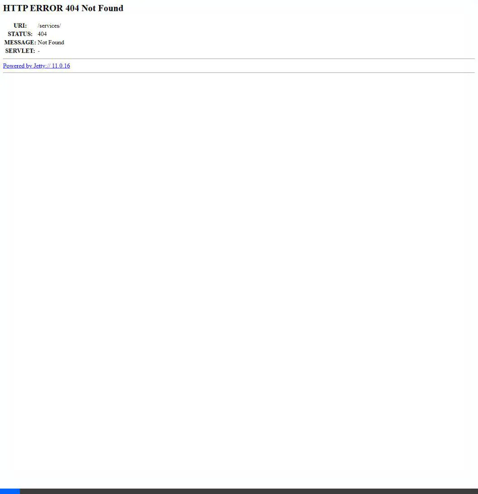
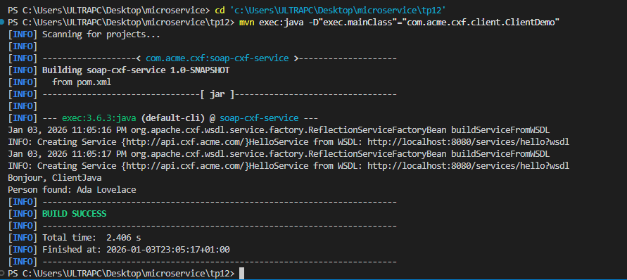

# TP 12 : Service SOAP avec Apache CXF

Ce projet implémente un service SOAP "HelloService" sécurisé avec WS-Security (UsernameToken) utilisant Apache CXF.

## Fonctionnalités
- **Service SOAP** : Opérations `SayHello` et `FindPerson`.
- **Apache CXF** : Framework JAX-WS.
- **Sécurité** : Intercepteur WS-Security pour validation Username/Password.
- **Client Java** : Exemple de consommation du service.

## Endpoints
Le service propose les endpoints suivants :
1. **WSDL (Description du service)** : `http://localhost:8080/services/hello?wsdl`
   - Permet de voir les définitions des opérations (`SayHello`, `FindPerson`).
2. **Endpoint SOAP** : `http://localhost:8080/services/hello`
   - Point d'entrée pour les requêtes SOAP (POST uniquement).

### Vérification du WSDL (Vidéo)
Voici l'enregistrement de la navigation sur le WSDL dans le navigateur, confirmant la présence du service et des opérations :



*(Note : Si l'image ci-dessus est une vidéo WebP, elle peut nécessiter un navigateur compatible pour l'animation.)*

## Lancer le projet
1. **Démarrer le serveur** :
   ```bash
   mvn clean compile exec:java -D"exec.mainClass"="com.acme.cxf.Server"
   ```
2. **Lancer le client** :
   ```bash
   ```bash
   mvn exec:java -D"exec.mainClass"="com.acme.cxf.client.ClientDemo"
   ```

## Résultat de l'exécution (Client Java)
Voici la preuve que le client Java communique correctement avec le service SOAP :


